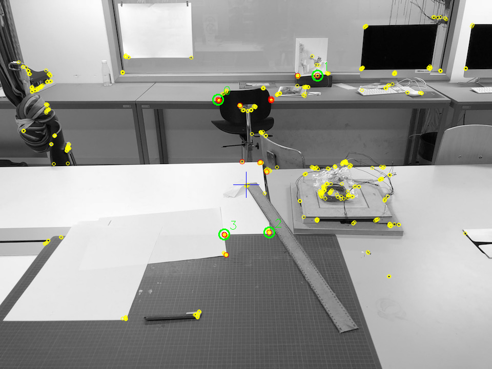
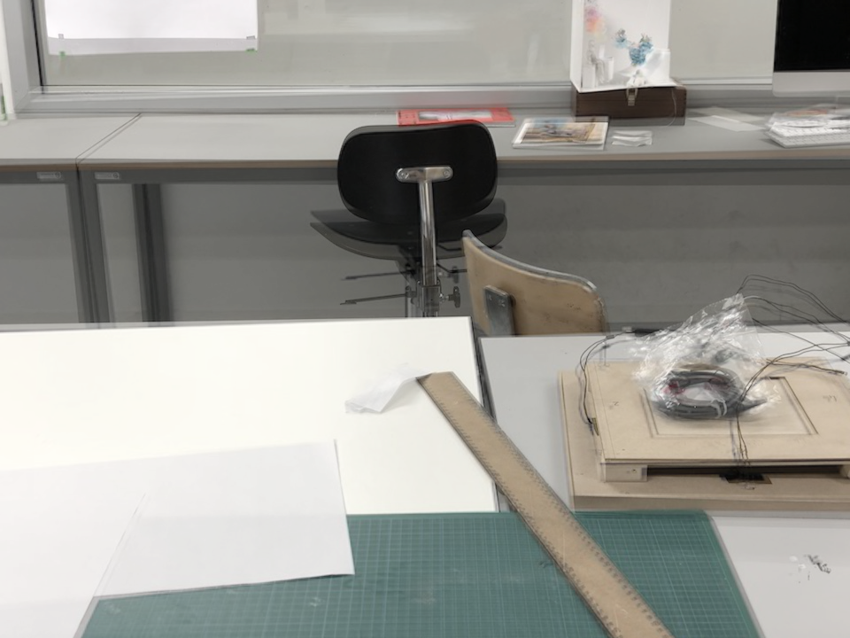

# Image Perspective Transform
Transform the perspective of an image into a reference image perspective.

### How the algorithm works?
* As input the algorithm gets `referenceImage` and `originalImage`
* First it runs a feature detection over both images
* The features are matched, and 4 of them selected for the perspective transformation
    * The 4 features are in the top `n` best matched features and the ones with the longest distance to each other 
* Perspective transformation is performed on the `originalImage`
* Transformed image is returned

### Current State
* The algorithm works great if the feature matching is doing it's job. If a feature is miss-matched, the algorithm is not able to find the right transformation matrix. 
* To speed up the algorithm `FLANN` could be to used for image matching
* Also `Homography` would be an alternative to this algorithm.


### Algorithms

* ORB for feature detection
* BFMatcher for matching
* Perspective and warping by opencv

### How To

```kotlin
// load images
val train = Imgcodecs.imread("reference.png")
val query = Imgcodecs.imread("original.png")
val result = query.copy()

// create transformer with n=100 features 
val transformer = SimplePerspectiveTransformer(100)

// read matrix and apply transform
val matrix = transformer.detectTransformMatrix(train, query)
transformer.transform(result, matrix)
```

### Example
Here is an illustrated example how the algorithm performs.

#### Reference Image


#### Original Image


#### Transformed Image


#### Additive Composition


### About
Algorithms by opencv / Florian Bruggisser *(ZHdK 2018)*