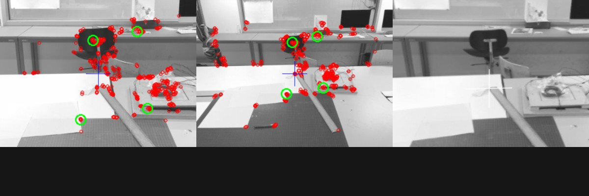

# Image View Angle Transform
Transform the view angle of an image onto another image of the same object.

### How the algorithm works?
* As input the algorithm gets `referenceImage` and `originalImage`
* First it runs a feature detection over both images
* The features are matched, and 4 of them selected for the perspective transformation
    * The 4 features are in the top `n` best matched features and the one's with the largest space between them 
* Perspective transformation is performed on the `originalImage`
* Transformed image is returned

### Current State

### Algorithms

* ORB for feature detection
* BFMatcher for matching
* Perspective and warping by opencv